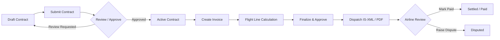

# Product Guide

> Baseline: Functionality completed through Phase 9 (and Phase 1–9 Audit Remediation)  
> Audience: Ground-handler and airline users, operations managers, and billing specialists  
> Screenshot status: Pending final UI theme stabilization

The Airline Ground Handling Cost Management Platform connects ground handlers
and airlines through a shared, multi-tenant contract, procurement, invoicing,
market intelligence, and dispute resolution workflow.

- **Ground Handlers** manage pricing contracts across all 7 pricing formulas,
  create flight-level invoices with automated calculation against active contracts,
  dispatch IATA IS-XML and PDF invoices, track pending invoicing (SFR4), monitor
  receivables and operational footprints (SOR2), respond to airline RFPs, and
  collaborate on disputes with automated credit-note generation.
- **Airlines** review contracts and dispatched invoices, request contract
  reviews, download invoice XML and PDF files, record payment settlements,
  discover suppliers in the marketplace, initiate and award RFPs, analyze market
  rates with the Airport Cost Index and Pricing Benchmarks, view financial and
  footprint analytics (AFR1, AFR2, AOR1, AOR2), and raise line-item SLA disputes.

## Choose Your Guide

- [Getting started](getting-started.md) explains tenant workspaces, authentication,
  navigation, and core status concepts.
- [Ground-handler guide](ground-handler-guide.md) covers supplier dashboards,
  contract lifecycle, review requests, invoice creation, dispatch, payment tracking,
  pending invoicing, and dispute responses.
- [Airline guide](airline-guide.md) covers airline dashboards, contract and invoice
  visibility, review requests, invoice downloads, payment updates, and dispute
  initiation.
- [Marketplace and RFPs](marketplace-and-rfps.md) covers service publication,
  supplier discovery, RFP creation, proposals, evaluation, and contract awards.
- [Market intelligence and analytics](market-intelligence-and-analytics.md)
  covers the Airport Cost Index, Pricing Benchmark, Airline MIS panels (AFR1, AFR2,
  AOR1, AOR2), and Supplier MIS panels (SFR1, SFR2, SFR3, SFR4, SOR1, SOR2).
- [Disputes and credit notes](disputes-and-credit-notes.md) covers line-item dispute
  raising, the resolution thread, evidence attachments, virus-scanning controls,
  and automated IATA IS-XML credit-note issuance.
- [Roles and access](roles-and-access.md) summarizes role capabilities and
  dimensional access-control behavior (ABAC).
- [Feature availability](feature-availability.md) details current, partial,
  and future roadmap capabilities (Phase 10).

## End-to-End Workflow Lifecycles

### 1. Contract & Invoicing Workflow

1. A ground handler creates a contract with defined service pricing formulas and
   submits it for approval.
2. An authorized reviewer approves the contract or requests changes.
3. The ground handler enters flight operational data against approved contract
   services; line items and totals are auto-calculated.
4. An authorized approver finalizes and approves the invoice.
5. The invoice is dispatched to the airline with generated IATA IS-XML and PDF
   attachments.
6. The airline reviews the dispatched invoice and either marks it as paid or
   raises a dispute on specific line items.

### 2. Procurement & RFP Workflow

1. Ground handlers publish their airport and service offerings in the marketplace.
2. Airlines search the marketplace by region/airport/service and initiate an RFP.
3. Eligible ground handlers review the RFP and submit structured commercial proposals.
4. The airline evaluates proposals and awards one proposal.
5. Awarding the RFP automatically creates a traceable draft contract for the
   selected supplier and rejects competing proposals.

### 3. Dispute Resolution & Credit Note Workflow

1. An airline raises a dispute on invoice line items, selecting a category and
   providing explanatory comments.
2. The ground handler reviews the dispute queue and enters the dispute thread.
3. Both parties exchange messages and upload supporting evidence attachments
   (scanned for malware and validated for MIME types).
4. When the supplier accepts the dispute, the system automatically generates an
   application-contract IATA IS-XML credit note offsetting the disputed amount.

## Documentation Conventions

- Menu and button labels appear in **bold** (e.g. **Contracts**, **Submit Invoice**).
- Status codes appear in `code format` (e.g. `APPROVED`, `SENT`, `DISPUTED`).
- What a user can view or execute depends on their assigned tenant, roles, and
  dimensional scope (airports, airlines, service types).
