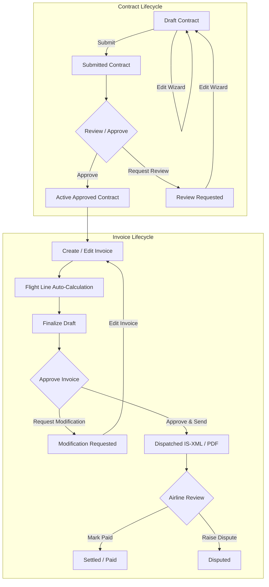

# Product Guide

> Baseline: Functionality completed through Phase 10 (Dynamic Formula Authoring, Comprehensive Entity Editing, Platform Administration)  
> Audience: Ground-handler, airline, and platform administrator users, operations managers, and billing specialists  
> Screenshot status: Pending final UI theme stabilization

The Airline Ground Handling Cost Management Platform connects ground handlers,
airlines, and platform administrators through a shared, multi-tenant contract, procurement, invoicing,
market intelligence, dispute resolution, and administrative workflow.

- **Ground Handlers** author and edit pricing contracts across all 7 dynamic pricing formulas (PF-01 to PF-07),
  create and edit flight-level invoices with automated calculation against active contracts,
  dispatch IATA IS-XML and PDF invoices, track pending invoicing (SFR4), monitor
  receivables and operational footprints (SOR2), publish/edit service marketplace offerings,
  respond to and revise airline RFP proposals, and collaborate on disputes with automated credit-note generation.
- **Airlines** review contracts and dispatched invoices, request contract
  reviews, download invoice XML and PDF files, record payment settlements,
  discover suppliers in the marketplace, initiate, publish, and edit RFPs, analyze market
  rates with the Airport Cost Index and Pricing Benchmarks, view financial and
  footprint analytics (AFR1, AFR2, AOR1, AOR2), and raise line-item SLA disputes.
- **Platform Administrators** manage multi-tenant organization provisioning (ground handlers and airlines),
  configure user identity, roles, and fine-grained Attribute-Based Access Control (ABAC) with
  airport, airline, and service charge code dimensional restrictions.

## Choose Your Guide

- [Getting started](getting-started.md) explains tenant workspaces, authentication,
  navigation, platform administration, and core status concepts.
- [Ground-handler guide](ground-handler-guide.md) covers supplier dashboards,
  dynamic formula contract authoring, contract editing & revision cycles, invoice creation & editing, dispatch, payment tracking,
  pending invoicing, and dispute responses.
- [Airline guide](airline-guide.md) covers airline dashboards, contract and invoice
  visibility, review requests, RFP authoring & editing, invoice downloads, payment updates, and dispute
  initiation.
- [Marketplace and RFPs](marketplace-and-rfps.md) covers service publication & editing,
  supplier discovery, RFP creation & editing, proposal submission & revision, evaluation, and contract awards.
- [Market intelligence and analytics](market-intelligence-and-analytics.md)
  covers the Airport Cost Index, Pricing Benchmark, Airline MIS panels (AFR1, AFR2,
  AOR1, AOR2), and Supplier MIS panels (SFR1, SFR2, SFR3, SFR4, SOR1, SOR2).
- [Disputes and credit notes](disputes-and-credit-notes.md) covers line-item dispute
  raising, the resolution thread, evidence attachments, virus-scanning controls,
  and automated IATA IS-XML credit-note issuance.
- [Roles and access](roles-and-access.md) summarizes role capabilities, platform administration, and
  dimensional access-control behavior (ABAC).
- [Feature availability](feature-availability.md) details current, delivered,
  and future roadmap capabilities (Phase 10).

## End-to-End Workflow Lifecycles

### 1. Contract & Invoicing Workflow

1. **Contract Authoring & Revisions**: A ground handler authors a contract using dedicated formula sub-editors (PF-01 through PF-07) and submits it for approval. If changes are needed, draft contracts or review-requested contracts can be edited via the Contract Wizard.
2. **Contract Approval**: Authorized reviewers approve the contract or request changes with commentary.
3. **Invoice Entry & Calculations**: The ground handler enters flight operational data against approved contract services. Invoices can be edited while in `DRAFT` or `MODIFICATION_REQUESTED` status.
4. **Finalization & Approval**: Invoice approvers finalize and approve invoices, or request modifications with feedback.
5. **Dispatch**: The invoice is dispatched with standard IATA IS-XML and PDF attachments, locking the invoice against further edits (`SENT`).
6. **Settlement or Dispute**: The airline reviews the dispatched invoice and either marks it as paid or raises a dispute on specific line items.

### 2. Procurement & RFP Workflow

1. Ground handlers publish their airport and service offerings in the marketplace (and can edit descriptions or capabilities at any time).
2. Airlines search the marketplace by region/airport/service and initiate or publish an RFP (and can edit RFP requirements and contract dates while open).
3. Eligible ground handlers review the RFP and submit structured commercial proposals (and can edit/revise submitted bid rates and terms prior to decision).
4. The airline evaluates proposals and awards one proposal.
5. Awarding the RFP automatically creates a traceable draft contract for the selected supplier and rejects competing proposals.

### 3. Dispute Resolution & Credit Note Workflow

1. An airline raises a dispute on invoice line items, selecting a category and providing explanatory comments.
2. The ground handler reviews the dispute queue and enters the dispute thread.
3. Both parties exchange messages and upload supporting evidence attachments (scanned for malware and validated for MIME types).
4. When the supplier accepts the dispute, the system automatically generates an application-contract IATA IS-XML credit note offsetting the disputed amount.

## Documentation Conventions

- Menu and button labels appear in **bold** (e.g. **Contracts**, **Submit Invoice**, **Edit**).
- Status codes appear in `code format` (e.g. `APPROVED`, `REVIEW_REQUESTED`, `MODIFICATION_REQUESTED`, `SENT`, `DISPUTED`).
- What a user can view or execute depends on their assigned tenant, roles, and dimensional scope (airports, airlines, service types).
