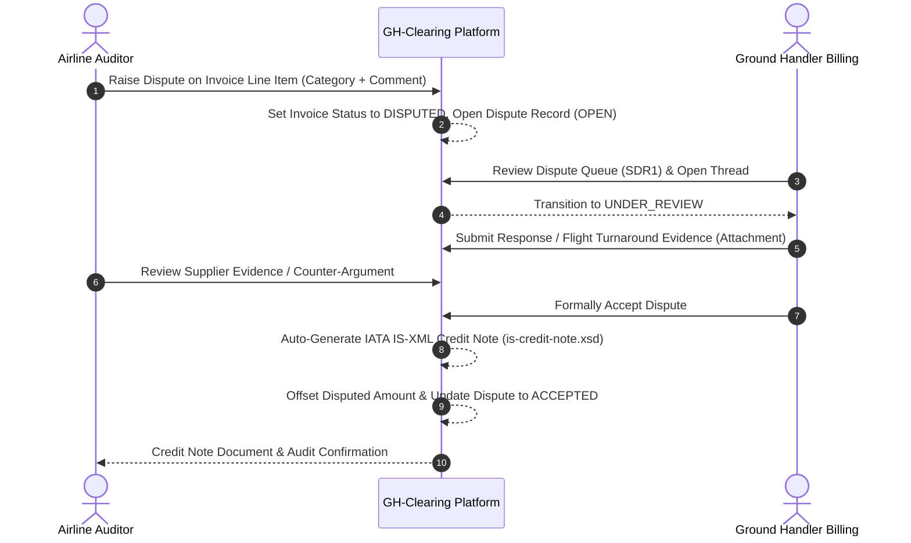

# Disputes and Credit Notes

Phase 9 delivers an end-to-end, multi-party dispute management workflow and automated credit note issuance system. It allows airlines to flag discrepant flight invoice line items, collaborate with ground handlers in real-time resolution threads with secure evidence attachments, and automatically issue compliant IATA IS-XML credit notes upon dispute resolution.

## 1. Raising an Invoice Dispute (Airline)

Airline users with the **Invoice Disputer** role can initiate disputes on dispatched invoices:

1. Navigate to **Invoices** in the Airline workspace.
2. Locate an invoice in status `SENT` or `DISPUTED`.
3. In the actions menu, click **Raise Dispute**.
4. In the dispute modal:
   - **Dispute Category**: Select one of the 5 standardized categories:
     - `OPERATIONAL_DATA_MISMATCH`: Turnaround times, flight numbers, aircraft type, or volume counts differ from operational flight logs.
     - `RATE_DISCREPANCY`: Applied unit rate does not match the active contract rate schedule.
     - `UNAUTHORIZED_SERVICE`: Charges billed for uncontracted or non-requested handling services.
     - `DUPLICATE_BILLING`: Flight or service already billed under another invoice.
     - `CALCULATION_ERROR`: Mathematical discrepancy, slab tier miscalculation, or incorrect FX exchange rate application.
   - **Dispute Comment**: Enter detailed operational context (e.g. flight date, actual passenger count, ground radar logs).
5. Click **Submit Dispute**.
6. The invoice status updates to `DISPUTED`, and a dispute record is created with initial state `OPEN`.

## 2. Dispute Management Workspace

Both ground handlers and airlines have access to a dedicated **Disputes** workspace (SDR1 for suppliers, ADR1 for airlines):

### Executive Metrics Summary Cards

- **Total Disputed Exposure**: Total monetary volume of all active and historical disputes.
- **Credit Notes Auto-Issued**: Total value of application-contract IS-XML credit notes generated from accepted disputes.
- **Active Disputes Queue**: Count of disputes currently in `OPEN`, `UNDER_REVIEW`, or `RESPONDED` states.
- **Resolved Disputes**: Count of successfully settled disputes (`ACCEPTED`).

### Filtering & Search

- **Search Bar**: Instant search by Dispute Reference Number (e.g. `DSP-2026-001`) or Invoice Number.
- **Dimensional Filters**: Filter by Airline (e.g. `EK`, `LH`, `QF`) and Station/Airport (e.g. `DXB`, `LHR`, `SYD`).
- **Status Tabs**:
  - `ALL`: Complete history of all disputes.
  - `OPEN`: Disputes requiring review or initial response.
  - `RESPONDED`: Active dialogue with recent counter-arguments or evidence.
  - `RESOLVED`: Closed disputes (`ACCEPTED`).

## 3. Dispute Resolution Thread & Actions

Click **View Thread & Act** on any dispute row to open the interactive dispute resolution thread.

### Dispute Lifecycle States

| Status | Meaning | Permitted Next Actions |
|---|---|---|
| `OPEN` | Dispute created by airline; awaiting supplier review | Supplier: View, Respond, Accept, Reject |
| `UNDER_REVIEW` | Supplier opened the dispute and is auditing operational data | Supplier: Respond, Accept, Reject; Airline: Respond, Escalate |
| `RESPONDED` | A party posted a response message or uploaded evidence | Supplier: Accept, Reject, Respond; Airline: Escalate, Respond |
| `ACCEPTED` | Supplier formally accepted the dispute; credit note generated | Terminal State (Settled) |
| `REJECTED` | Supplier formally rejected the dispute claim | Terminal State or Airline Escalation |
| `ESCALATED` | Airline escalated to commercial arbitration | Supplier: Accept, Reject, Respond |

### Authorized Actions

- **Ground Handler (Supplier)**:
  - **Respond**: Enter explanatory comments, flight logs, and upload supporting files.
  - **Accept Dispute**: Authorize settlement. This triggers the automatic generation of an IATA IS-XML Credit Note offsetting the invoice.
  - **Reject Dispute**: Provide formal justification and reject the claim.
- **Airline**:
  - **Respond**: Add counter-evidence or reply to supplier explanations.
  - **Escalate Dispute**: Flag for executive or legal review if resolution cannot be reached at the operational station level.

## 4. Secure Evidence Attachments & Virus Scanning

Both parties can upload supporting operational evidence (e.g. signed ramp sheets, radar turnaround logs, fuel slips, email agreements) directly within the dispute thread.

### Security & File Integrity Controls

- **Supported Formats**: PDF (`.pdf`), Images (`.png`, `.jpg`, `.jpeg`), CSV (`.csv`), Plain Text (`.txt`), XML (`.xml`).
- **File Size Limit**: Up to 10 MB per attachment.
- **Antivirus & Malware Scanning**: All uploaded files pass through a synchronous **ClamAV malware scanner** before being accepted. Any infected or malicious payload is rejected immediately.
- **MIME-Type & Magic Byte Validation**: Files are inspected at the binary level to prevent file extension spoofing.
- **Tenant-Isolated Storage**: Files are stored in tenant-namespaced object storage, accessible only to authorized airline and supplier participants.
- **Audit Logging**: All upload, download, and delete actions are permanently recorded in the audit trail.

## 5. Automated IATA IS-XML Credit Notes

When a supplier clicks **Accept Dispute**:

1. The platform generates an immutable **Credit Note** entity linked to the original invoice and dispute.
2. The **Credit Note XML Generator** creates an application-contract compliant **IATA IS-XML Credit Note** document according to `is-credit-note.xsd`.
3. The credit note XML contains:
   - Unique Credit Note Number and issue timestamp.
   - Reference to the original Invoice Number and Issue Date.
   - Airline and Supplier IATA identifiers.
   - Disputed line items, IATA charge codes, and credited monetary amounts.
4. The credited amount is recorded against `Invoice.creditNoteAmount`.
5. The credit note document is stored in the document repository and made available for download by both parties.
