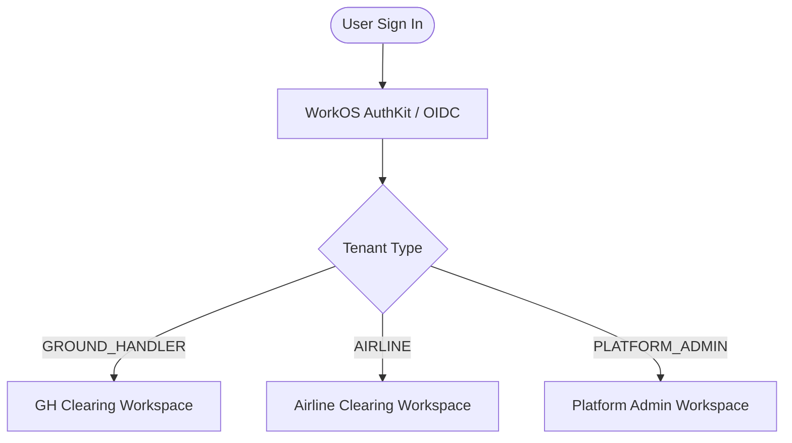

# Getting Started

## Workspaces & Multi-Tenancy

The platform provides dedicated, tenant-isolated workspaces tailored for each industry persona:

- **GH Clearing** for ground-handler organizations and station operators
- **Airline Clearing** for airline procurement, billing, and flight operations teams
- **Platform Admin** for system operators managing tenant organizations, user provisioning, and dimensional access controls

The workspace name appears in the top navigation panel, and the active scope indicator in the header displays your tenant ID (e.g. `SWISSPORT`, `EK`, `PLATFORM`) and tenant type (`GROUND_HANDLER`, `AIRLINE`, `PLATFORM_ADMIN`).



### Sign In & Authentication

- The platform integrates with **WorkOS AuthKit** for secure single sign-on (SSO) and OAuth2/OIDC authentication.
- For testing and staging environments, the header provides a simulated persona switcher allowing authorized operators to evaluate multi-dimensional access across airlines, ground handlers, and platform administrators.
- Click **Sign out** / **Reset Persona** in the top right to end your session or reset authentication context.

## Navigation & Workspaces

### Ground-Handler Workspace Navigation

The left navigation menu provides access to ground-handler operational modules:

- **Dashboard**: High-level financial KPIs, receivables aging, monthly invoiced volume, revenue per flight, contract expiry, Operational Footprint (SOR2), and Pending Invoicing (SFR4).
- **Contracts**: Author, edit, submit, approve, and filter service contracts with 7 dedicated pricing formula sub-editors.
- **Review Requests**: View and act on contract review requests submitted by airlines, and launch edit wizards to revise terms.
- **Invoices**: Create and edit flight-level draft invoices, auto-calculate charges, finalize, handle modification requests, approve, and dispatch IATA IS-XML / PDF packages.
- **RFP Summary**: Review received airline procurement RFPs, submit/edit commercial bid proposals, and monitor award outcomes.
- **Service Offerings**: Publish, edit, or withdraw airport station service capabilities for marketplace discovery.
- **Disputes**: Real-time dispute queue (SDR1), SLA audit resolution threads, evidence attachment exchange, and credit-note generation.
- **Configuration**: Supplier airport/airline enablement, backdating windows, and email endpoints (administrative).

### Airline Workspace Navigation

The left navigation menu provides access to airline procurement and financial management modules:

- **Airline Home**: Top-level action cards and executive analytics: Billed Amounts (AFR1), Expected Billing projections (AFR2), Contract Expiry timeline (AOR1), and Current Footprint map (AOR2).
- **Contracts**: Read-only directory of active approved supplier contracts scoped to your airline.
- **Review Requests**: Track the status and comments of contract review requests submitted to suppliers.
- **Invoices**: View dispatched supplier invoices, download generated IS-XML and PDF files, mark settlement status (`PAID`), and raise line-item disputes.
- **RFPs**: Create, publish, and edit procurement RFPs, review incoming supplier proposals, and award contracts.
- **Marketplace**: Search and discover published ground handling capabilities by region, airport, and service.
- **Cost Index**: Airport Cost Index and Pricing Benchmark comparing handling costs across airports and market quartiles.
- **Disputes**: Dedicated dispute management workspace (ADR1) for tracking audit queries, evidence, escalations, and credit notes.

### Platform Admin Workspace Navigation

Users authenticated with the `PLATFORM_ADMIN` role have access to central tenant and governance modules:

- **Dashboard**: Platform-wide metrics, tenant distribution by type, and global user activity.
- **Tenants**: Create and edit tenant organizations (ground handlers and airlines), modify organization names, and manage `ACTIVE`/`INACTIVE` statuses.
- **User Management**: Provision and manage users across all tenant organizations, assign roles, and configure multi-dimensional access boundaries (airport restrictions, airline restrictions, and charge code restrictions).

## Status Lifecycles

### Contract Lifecycle & Edit Cycles

```
DRAFT ──(Submit)──> SUBMITTED ──(Approve)──> APPROVED
  ▲                      │                      │
  │                      ▼                      ▼
  └──────(Edit)──── REVIEW_REQUESTED         EXPIRED
```

- **Editing Drafts**: Contracts in `DRAFT` status can be edited at any time using the **Edit** action button in the Contracts list.
- **Review-Requested Revisions**: When an approver or airline requests changes (`REVIEW_REQUESTED`), ground handlers can open the contract in the edit wizard, modify formula parameters or service lines, and resubmit for approval.
- **Immutability**: Contracts in `APPROVED` or `EXPIRED` status cannot be edited.

### Invoice Lifecycle & Modification Cycles

```
DRAFT ──(Finalize)──> FINALIZED ──(Approve & Send)──> SENT ──(Mark Paid)──> PAID
  ▲                      │                                │
  │                      ▼                                ▼
  └──────(Edit)──── MODIFICATION_REQUESTED            DISPUTED
```

- **Editing Drafts**: Invoices in `DRAFT` status can be modified via the **Edit** action button to update flight details, quantity drivers, or service lines.
- **Modification Requests**: If an approver requests corrections (`MODIFICATION_REQUESTED`), the invoice returns to an editable state. Once revised, the ground handler can re-finalize and approve the invoice.
- **Dispatch Immutability**: Once sent (`SENT`, `PAID`, or `DISPUTED`), invoices are permanently locked to preserve accounting integrity.
