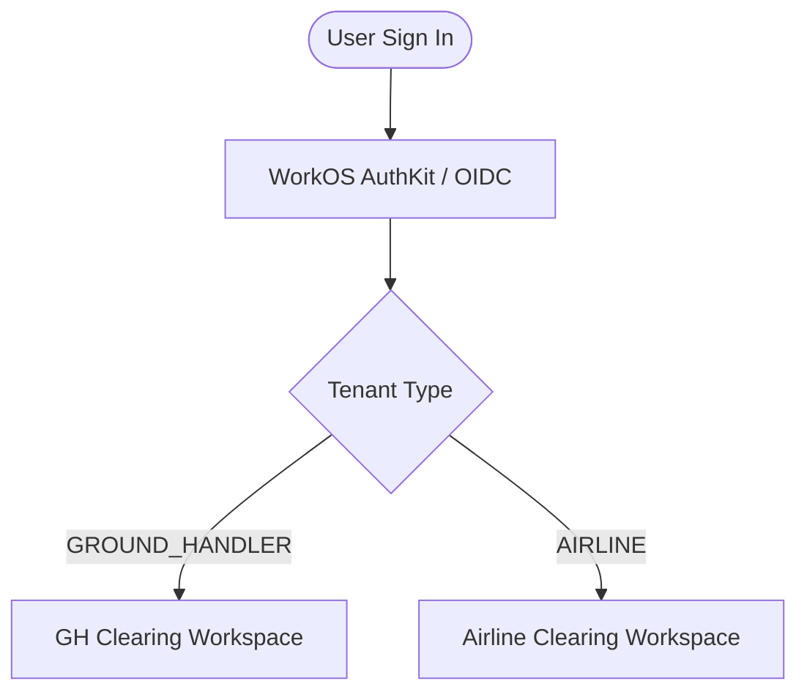

# Getting Started

## Workspaces & Multi-Tenancy

The platform provides dedicated, tenant-isolated workspaces tailored for each industry persona:

- **GH Clearing** for ground-handler organizations and station operators
- **Airline Clearing** for airline procurement, billing, and flight operations teams

The workspace name appears in the top navigation panel, and the active scope indicator in the header displays your tenant ID (e.g. `SWISSPORT`, `EK`) and tenant type (`GROUND_HANDLER` or `AIRLINE`).



### Sign In & Authentication

- The platform integrates with **WorkOS AuthKit** for secure single sign-on (SSO) and OAuth2/OIDC authentication.
- For testing and staging environments, the header provides a simulated persona switcher allowing authorized operators to evaluate multi-dimensional access across airlines and ground handlers.
- Click **Sign out** / **Reset Persona** in the top right to end your session or reset authentication context.

## Navigation & Workspaces

### Ground-Handler Workspace Navigation

The left navigation menu provides access to ground-handler operational modules:

- **Dashboard**: High-level financial KPIs, receivables aging, monthly invoiced volume, revenue per flight, contract expiry, Operational Footprint (SOR2), and Pending Invoicing (SFR4).
- **Contracts**: Create, submit, approve, and filter service contracts with 7 pricing formulas.
- **Review Requests**: View and act on contract review requests submitted by airlines.
- **Invoices**: Create flight-level draft invoices, auto-calculate charges, finalize, approve, and dispatch IATA IS-XML / PDF packages.
- **RFP Summary**: Review received airline procurement RFPs, submit commercial proposals, and monitor award outcomes.
- **Service Offerings**: Publish or withdraw airport station service capabilities for marketplace discovery.
- **Disputes**: Real-time dispute queue (SDR1), SLA audit resolution threads, evidence attachment exchange, and credit-note generation.
- **Configuration**: Supplier airport/airline enablement and email endpoints (administrative).

### Airline Workspace Navigation

The left navigation menu provides access to airline procurement and financial management modules:

- **Airline Home**: Top-level action cards and executive analytics: Billed Amounts (AFR1), Expected Billing projections (AFR2), Contract Expiry timeline (AOR1), and Current Footprint map (AOR2).
- **Contracts**: Read-only directory of active approved supplier contracts scoped to your airline.
- **Review Requests**: Track the status and comments of contract review requests submitted to suppliers.
- **Invoices**: View dispatched supplier invoices, download generated IS-XML and PDF files, mark settlement status (`PAID`), and raise line-item disputes.
- **RFPs**: Create and publish procurement RFPs, review incoming supplier proposals, and award contracts.
- **Marketplace**: Search and discover published ground handling capabilities by region, airport, and service.
- **Cost Index**: Airport Cost Index and Pricing Benchmark comparing handling costs across airports and market quartiles.
- **Disputes**: Dedicated dispute management workspace (ADR1) for tracking audit queries, evidence, escalations, and credit notes.

## Status Lifecycles

### Contract Lifecycle

```
DRAFT ──(Submit)──> SUBMITTED ──(Approve)──> APPROVED
                         │                      │
                  (Request Review)        (Request Review)
                         │                      │
                         ▼                      ▼
                  REVIEW_REQUESTED       REVIEW_REQUESTED
```

- `DRAFT`: Saved contract draft, editable only by supplier contract creators.
- `SUBMITTED`: Under review by an authorized reviewer/approver.
- `APPROVED`: Validated and active for flight invoicing.
- `REVIEW_REQUESTED`: Marked for revision by an approver or airline partner; requires update and resubmission.

### Invoice Lifecycle

```
DRAFT ──(Finalize)──> FINALIZED ──(Approve)──> APPROVED ──(Send)──> SENT ──(Mark Paid)──> PAID
                          │                                           │
                  (Request Mod)                                  (Raise Dispute)
                          │                                           │
                          ▼                                           ▼
                  MOD_REQUESTED                                   DISPUTED
```

- `DRAFT`: Flight line items and operational quantities entered; calculated line totals.
- `FINALIZED`: Locked for final approval review.
- `APPROVED`: Ready for document generation and email dispatch.
- `SENT`: IS-XML and PDF generated; dispatched to airline; read-only.
- `PAID`: Marked as settled by either airline or supplier.
- `DISPUTED`: Line item flagged by airline; opens dispute management record.

### Dispute Lifecycle

```
OPEN ──(Supplier Review)──> UNDER_REVIEW ──(Supplier Reply)──> RESPONDED
  │                                                                 │
  ├──(Supplier Accept)──> ACCEPTED (Auto Credit Note Issued)       ├──(Supplier Accept)──> ACCEPTED
  ├──(Supplier Reject)──> REJECTED                                ├──(Supplier Reject)──> REJECTED
  └──(Airline Escalate)─> ESCALATED                               └──(Airline Escalate)─> ESCALATED
```

- `OPEN`: Dispute initiated by airline on one or more invoice line items.
- `UNDER_REVIEW`: Supplier is actively auditing the operational flights and logs.
- `RESPONDED`: Supplier or airline provided commentary or evidence in the thread.
- `ACCEPTED`: Supplier accepted the dispute; an application-contract IATA IS-XML credit note is automatically generated.
- `REJECTED`: Supplier rejected the claim with justification.
- `ESCALATED`: Airline escalated the dispute for management arbitration.

### RFP Lifecycle

- `PUBLISHED`: Open for eligible ground handlers to submit commercial proposals.
- `AWARDED`: Airline accepted one proposal; a supplier-owned draft contract is created, and competing proposals are rejected.
- `CLOSED`: Procurement window closed without an award.

## Multi-Dimensional Access Control (ABAC)

All views, data listings, metrics, and actions are strictly filtered according to:

1. **Tenant Isolation**: Strict logical database isolation between airlines and ground handlers.
2. **Role Authorization**: Role permissions dictate who can create, approve, view, or modify records.
3. **Dimensional Scoping**: Users are assigned specific allowed:
   - **Airports** (e.g. `DXB`, `LHR`, `SYD`)
   - **Airlines** (for ground handler staff)
   - **Service Types** (e.g. `RAMP`, `PASSENGER_SERVICES`, `CARGO`, `DEICING`)

> [!NOTE]
> If a table or dashboard panel appears empty, check that your active airport, airline, and date filters match your authorized dimensional assignments. Clear optional filters first before requesting administrative role assistance.
