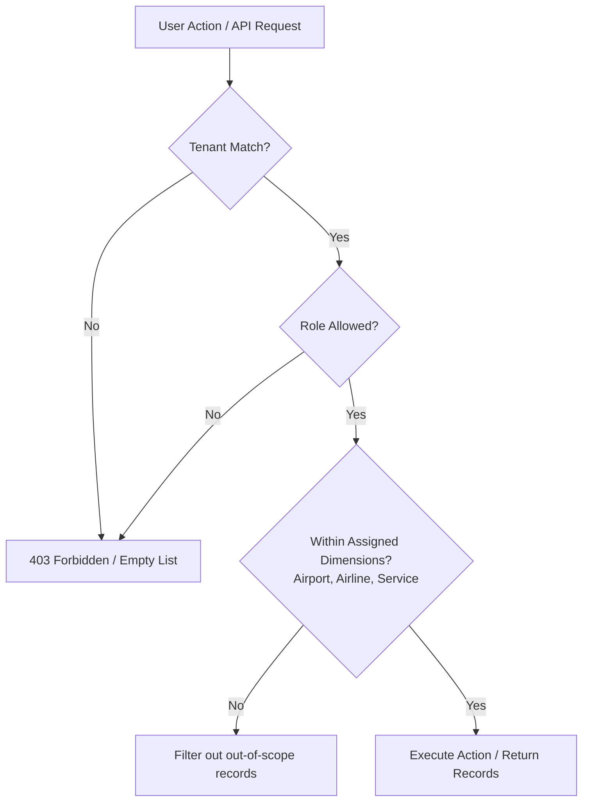

# Roles and Access

Access in the platform is multi-dimensional and role-based (ABAC): a user may hold one or more roles, with all actions and data queries strictly bounded by their tenant identity and assigned dimensional scope.

## Platform Administrator Role

| Role | Primary Capability | Available Modules & Actions |
|---|---|---|
| **Platform Admin (`PLATFORM_ADMIN`)** | Platform tenant governance & user administration | Manage global tenant organizations (create/edit ground handlers and airlines, update status), provision users across all tenants, and configure multi-tenant ABAC dimensional restrictions (airports, airlines, charge codes) |

## Ground-Handler Roles

| Role | Primary Capability | Available Modules & Actions |
|---|---|---|
| **Admin** | Tenant configuration and user management | Manage enabled airlines, airports, email endpoints, backdating rules, and user roles |
| **Contract Entry** | Author and edit contracts | Author contracts with 7 dedicated formula sub-editors (PF-01 to PF-07), edit drafts, revise review-requested contracts, and submit for approval |
| **Contract Reviewer/Approver** | Contract governance | Approve submitted contracts, request review changes with mandatory comments |
| **Invoice Entry** | Invoice creation, editing & calculation | Enter flight turnaround logs, edit draft and modification-requested invoices, trigger auto-calculation, submit draft invoices |
| **Invoice Approver** | Invoice governance & dispatch | Finalize draft invoices, request modifications with comments, approve invoices, trigger IS-XML/PDF generation and email dispatch |
| **Invoice Status Updater** | Settlement tracking | Mark dispatched/disputed invoices as `PAID` |
| **MIS Viewer** | Analytics & reporting | View supplier dashboard, SFR1 (Receivables), SFR2 (Invoiced Trends), SFR3 (Revenue/Flight), SOR1 (Expiry), SOR2 (Operational Footprint), SFR4 (Pending Invoicing) |
| **RFP Monitor & Responder** | Procurement & marketplace | Publish, edit, and remove station service offerings; view eligible RFPs; submit and revise commercial bid proposals (SOR3) |
| **Dispute Handler** | Dispute collaboration | View supplier dispute queue (SDR1), review flight audit logs, exchange messages and evidence attachments |
| **Dispute Approver** | Dispute settlement & credit notes | Formally accept disputes (triggers automated IATA IS-XML credit note issuance) or reject dispute claims |

*Ground-handler dimensional scope can restrict access by Airport, Airline, and Service Type.*

## Airline Roles

| Role | Primary Capability | Available Modules & Actions |
|---|---|---|
| **Invoice Reviewer** | Invoice auditing | View dispatched invoices and line items; download generated IATA IS-XML and PDF invoices |
| **Invoice Disputer** | Dispute management | Raise line-item disputes on invoices with category & comments; participate in dispute threads, upload evidence (ADR1), escalate disputes |
| **Contract Viewer** | Contract directory | Read-only access to approved, non-draft contracts scoped to the airline |
| **Contract Reviewer** | Contract renegotiation | Submit contract review requests with mandatory feedback comments; track review history (AOR3) |
| **RFP Raiser** | Procurement management | Search marketplace offerings, create, publish, and edit RFPs, evaluate supplier rate proposals (including revised bids), award contracts |
| **MIS Viewer** | Financial & operational analytics | View executive dashboards: AFR1 (Billed Amounts), AFR2 (Expected Billing), AOR1 (Contract Expiry), AOR2 (Current Footprint), Airport Cost Index, and Pricing Benchmarks |
| **Payment Status Updater** | Treasury settlement | Mark eligible dispatched or disputed invoices as `PAID` |

*Airline dimensional scope can restrict access by Airport and Service Type.*

## Dimensional Access Enforcement

The platform enforces Attribute-Based Access Control (ABAC) across all queries and state mutations:

## Troubleshooting Missing Data or Actions

If an expected invoice, contract, or action is not visible:

1. **Check Active Workspace**: Verify whether you are logged into **GH Clearing**, **Airline Clearing**, or **Platform Admin**.
2. **Clear Optional Filters**: Reset airline, airport, and date range filters on the page.
3. **Verify Lifecycle State**: Ensure the record is in a state visible to your persona (e.g. airlines see only `APPROVED` contracts and `SENT`/`DISPUTED`/`PAID` invoices).
4. **Verify Dimensional Scoping**: Confirm with your tenant administrator that your user profile has the required airport, airline, or service-type assignments.
5. **Check Role Permissions**: Ensure your profile has the necessary role for write actions (e.g., `CONTRACT_ENTRY` to edit contracts, `INVOICE_ENTRY` to edit invoices, `INVOICE_APPROVER` to send invoices, `DISPUTE_APPROVER` to accept disputes).
